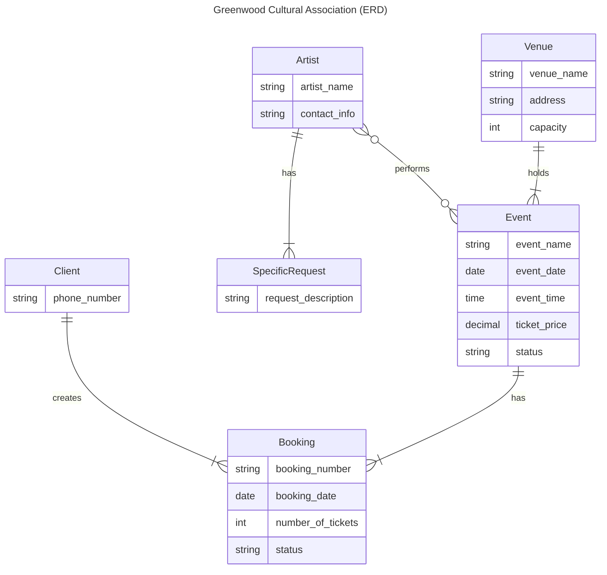
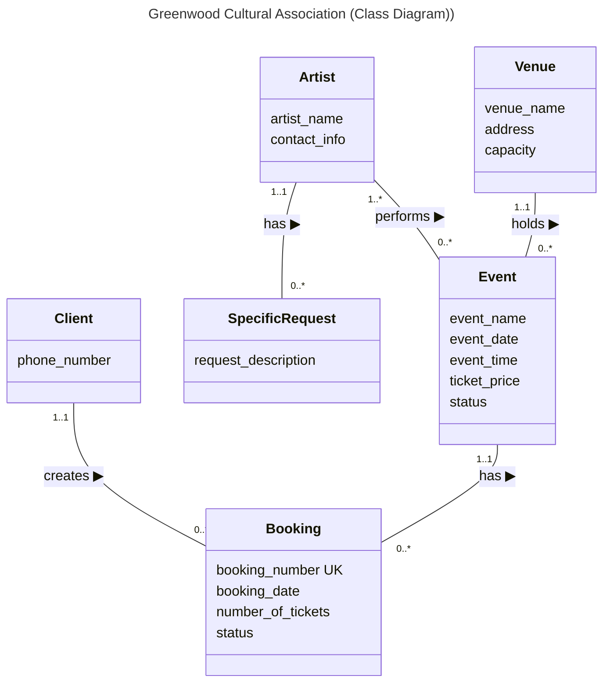

# Step 1: Database modelling and logical design

Change history:

| Team member | Task | Working time |
| --- | --- | --- |
| Thanh Ha Nguyen | Create an ER diagram draft | 2 hours |
| Thanh Ha Nguyen | Revise the ER diagram, add the ERD-like class diagram and the logical design | 6 hours |
| ... | ... | ... |

## Conceptual Design (ER Diagram)

## Conceptual Design (Class Diagram)

This diagram represents the same entities and relationships as the ER diagram above but in a different style of ERD taught in the course.

## Logical Database Design (Relation Schemas)

This section outlines the relational schema derived from the conceptual model, including primary keys and foreign keys to represent relationships and ensure data integrity.

<pre>
Client (<ins>client_number</ins>, phone_number)
Venue (<ins>venue_number</ins>, venue_name, address, capacity)
Artist (<ins>artist_number</ins>, artist_name, contact_info)
SpecificRequest (<ins>request_number</ins>, request_description, artist_number)
    FK (artist_number) REFERENCES Artist (artist_number)
Event (<ins>event_number</ins>, event_name, event_date, event_time, ticket_price, status, venue_number)
    FK (venue_number) REFERENCES Venue (venue_number)
Booking (<ins>booking_number</ins>, booking_date, number_of_tickets, status, client_number, event_number)
    FK (client_number) REFERENCES Client (client_number)
    FK (event_number) REFERENCES Event (event_number)
</pre>
