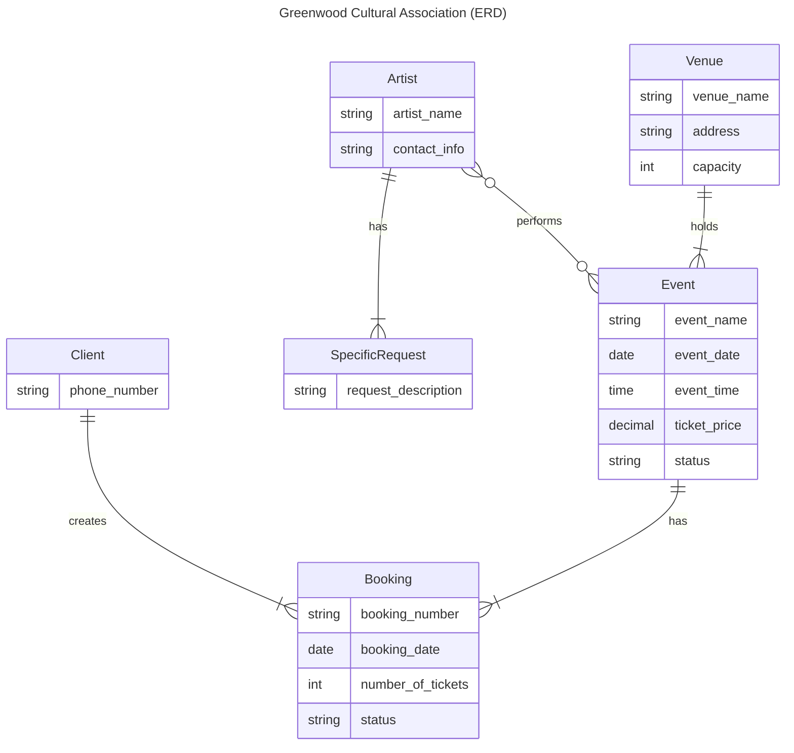
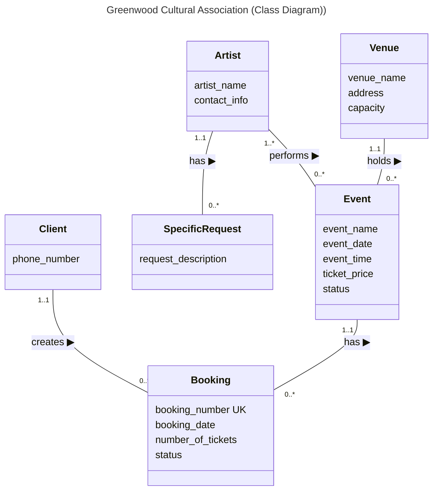

# Step 1: Database modelling and logical design

Change history:

| Team member     | Task                                                                         | Working time |
| --------------- | ---------------------------------------------------------------------------- | ------------ |
| Thanh Ha Nguyen | Create an ER diagram draft                                                   | 2 hours      |
| Thanh Ha Nguyen | Revise the ER diagram, add the ERD-like class diagram and the logical design | 5 hours      |
| Thanh Ha Nguyen | Add entity type definitions                                                  | 2 hours      |
| Ngoc Nguyen     | Review the conceptual design, ER diagram                                     | 2 hours      |
| Thao Dinh       | Review the logical design                                                    | 2 hours      |

## Conceptual Design (ER Diagram)

### ENTITY TYPE DESCRIPTIONS

| **ENTITY TYPE**     | **Description**                                 | **Synonyms, aliases**      | **Occurrence**                                         |
| :------------------ | :---------------------------------------------- | :------------------------- | :----------------------------------------------------- |
| Client              | An individual making a booking.                 | Customer, User             | Multiple clients expected.                             |
| Venue               | A physical location where events are hosted.    | Location, Hall             | Limited venues (e.g., 3 initially, potential for more).|
| Artist              | A performer or group scheduled to perform.      | Performer, Group           | Multiple artists may perform.                          |
| SpecificRequest     | Special requirements for an artist for an event.| Artist Requirement, Rider  | An artist may have zero or more requests.              |
| Event               | A scheduled cultural performance or activity.   | Performance, Show, Activity| Multiple events are scheduled.                         |
| Booking             | A client's reservation of tickets for an event. | Reservation, Ticket Order  | Multiple bookings per event, per client.               |

### ATTRIBUTE TYPE DESCRIPTIONS

#### Client
| **Attribute type** | **Description**                                | **Data type** | **Value required** | **Identity attribute or part of it** | **Special domain** |
| ------------------ | ---------------------------------------------- | ------------- | ------------------ | ------------------------------------ | ------------------ |
| phone_number       | Client's contact phone number                  | Text          | Yes                | -                                    | Valid phone format |

#### Venue
| **Attribute type** | **Description**                                | **Data type** | **Value required** | **Identity attribute or part of it** | **Special domain** |
| ------------------ | ---------------------------------------------- | ------------- | ------------------ | ------------------------------------ | ------------------ |
| venue_name         | Name of the venue                              | Text          | Yes                | -                                    | -                  |
| address            | Physical address of the venue                  | Text          | Yes                | -                                    | -                  |
| capacity           | Maximum number of people the venue can hold    | Integer       | Yes                | -                                    | e.g., 60, 250, 600 |

#### Artist
| **Attribute type** | **Description**                                | **Data type** | **Value required** | **Identity attribute or part of it** | **Special domain** |
| ------------------ | ---------------------------------------------- | ------------- | ------------------ | ------------------------------------ | ------------------ |
| artist_name        | Name of the artist or group                    | Text          | Yes                | -                                    | -                  |
| contact_info       | Contact details for the artist                 | Text          | -                  | -                                    | -                  |

#### SpecificRequest
| **Attribute type**  | **Description**                                | **Data type** | **Value required** | **Identity attribute or part of it** | **Special domain** |
| ------------------- | ---------------------------------------------- | ------------- | ------------------ | ------------------------------------ | ------------------ |
| request_description | Detailed description of the requirement        | Text          | Yes                | -                                    | -                  |

#### Event
| **Attribute type** | **Description**                                | **Data type** | **Value required** | **Identity attribute or part of it** | **Special domain**             |
| ------------------ | ---------------------------------------------- | ------------- | ------------------ | ------------------------------------ | ------------------------------ |
| event_name         | Name of the event                              | Text          | Yes                | -                                    | -                              |
| event_date         | Date on which the event takes place            | Date          | Yes                | -                                    | -                              |
| event_time         | Time on which the event starts                 | Time          | Yes                | -                                    | -                              |
| ticket_price       | The price of a single ticket for this event    | Decimal       | Yes                | -                                    | Non-negative                   |
| status             | Current status of the event                    | Text          | Yes                | -                                    | e.g., 'scheduled', 'cancelled' |

#### Booking
| **Attribute type** | **Description**                                    | **Data type** | **Value required** | **Identity attribute or part of it** | **Special domain**                  |
| ------------------ | -------------------------------------------------- | ------------- | ------------------ | ------------------------------------ | ----------------------------------- |
| booking_number     | Unique number to identify the booking for purchase | Text          | Yes                | -                                    | -                                   |
| booking_date       | Date on which the booking was made                 | Date          | Yes                | -                                    | -                                   |
| number_of_tickets  | Quantity of tickets reserved                       | Integer       | Yes                | -                                    | Positive integer                    |
| status             | Current status of the booking                      | Text          | Yes                | -                                    | e.g., 'booked', 'sold', 'cancelled' |

## Conceptual Design (Class Diagram)

This diagram represents the same entities and relationships as the ER diagram above but in a different style of ERD taught in the course.

## Logical Database Design (Relation Schemas)

This section outlines the relational schema derived from the conceptual model, including primary keys and foreign keys to represent relationships and ensure data integrity.

<pre>
Client (<ins>client_number</ins>, phone_number)
Venue (<ins>venue_number</ins>, venue_name, address, capacity)
Artist (<ins>artist_number</ins>, artist_name, contact_info)
SpecificRequest (<ins>request_number</ins>, request_description, artist_number)
    FK (artist_number) REFERENCES Artist (artist_number)
Event (<ins>event_number</ins>, event_name, event_date, event_time, ticket_price, status, venue_number)
    FK (venue_number) REFERENCES Venue (venue_number)
Booking (<ins>booking_number</ins>, booking_date, number_of_tickets, status, client_number, event_number)
    FK (client_number) REFERENCES Client (client_number)
    FK (event_number) REFERENCES Event (event_number)
</pre>
