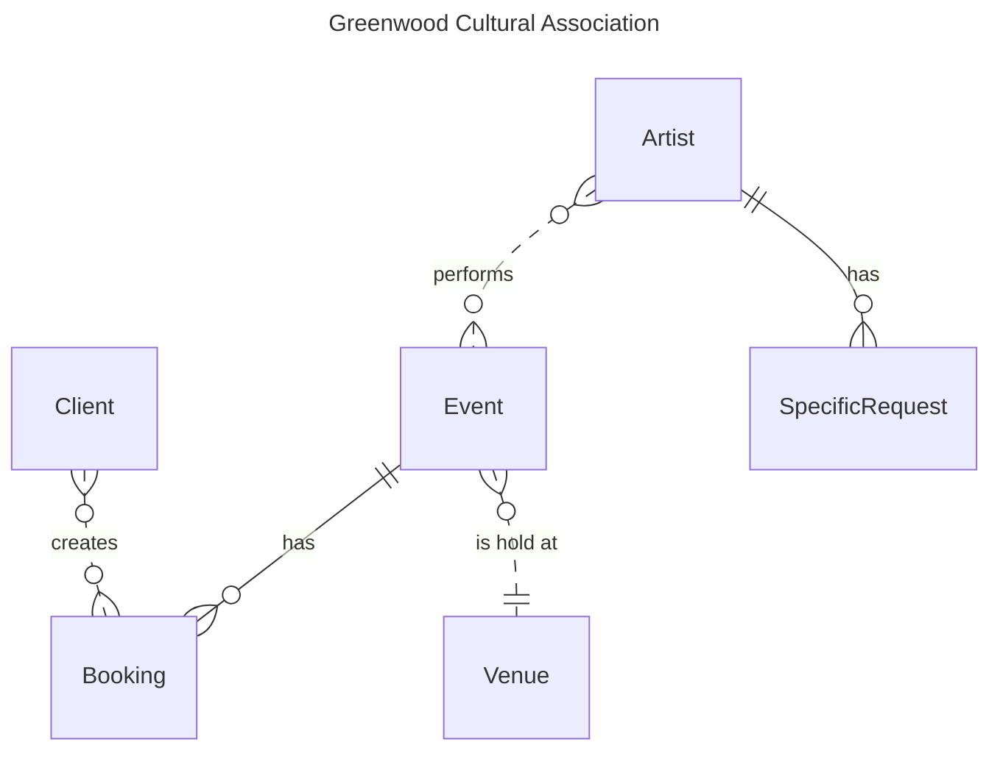

# Step 1: Database modelling and logical design

Change history:

| Team member | Task | Working time |
| --- | --- | --- |
| Thanh Ha Nguyen | Create ER diagram draft | 2 hours |
| ... | ... | ... |

## Conceptual Design

